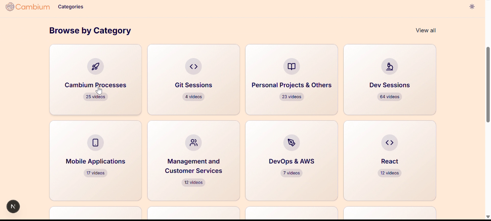
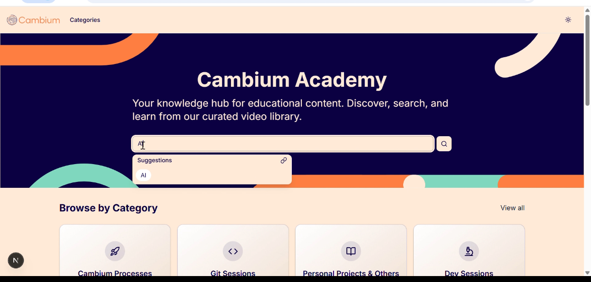
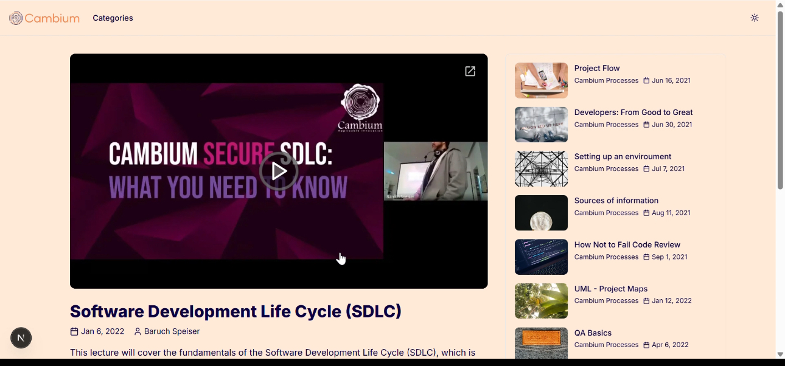

# Cambium Academy

A modern, responsive educational platform built with Next.js that serves as a knowledge hub for educational content. Cambium Academy provides an intuitive interface for discovering, searching, and learning from a curated video library organized by categories.

## 🎯 Project Overview

Cambium Academy is a comprehensive educational platform that aggregates and organizes educational video content. The platform features a clean, modern design with powerful search capabilities, category-based organization, and a responsive interface that works seamlessly across all devices.

### Key Features

- **📚 Educational Content Hub**: Centralized repository for educational videos and resources
- **🔍 Advanced Search**: Intelligent search with suggestions and filtering capabilities
- **📂 Category Organization**: Content organized by categories for easy navigation
- **📱 Responsive Design**: Optimized for desktop, tablet, and mobile devices
- **🎨 Modern UI/UX**: Clean, accessible interface with dark/light theme support
- **⚡ Performance Optimized**: Built with Next.js 15 and modern web technologies
- **📊 Data Integration**: Seamless integration with Google Sheets for content management
- **🎬 Video Management**: Comprehensive video library with metadata, slides, and related content
- **🔗 Smart Suggestions**: Real-time search suggestions based on titles, categories, and speakers

## 🚀 Technology Stack

- **Framework**: Next.js 15 with App Router
- **Language**: TypeScript
- **Styling**: Tailwind CSS with custom design system
- **UI Components**: Radix UI primitives
- **Animations**: Framer Motion
- **Data Source**: Google Sheets API
- **Icons**: Lucide React
- **Theme**: Next Themes with dark/light mode support
- **Carousel**: Embla Carousel React
- **State Management**: React hooks and context

## 📸 Screenshots

### Homepage Overview

*The main landing page featuring the hero section with search functionality and featured content*

### Category Navigation

*Category-based content organization with grid layout and filtering options*

### Video Content

*Detailed video pages with related content and comprehensive information*

## 🛠️ Getting Started

### Prerequisites

- Node.js 18+ 
- npm, yarn, pnpm, or bun
- Google Sheets API key
- Google Sheets spreadsheet with educational content

### Installation

1. **Clone the repository**
   ```bash
   git clone <repository-url>
   cd cambium_academy
   ```

2. **Install dependencies**
   ```bash
   npm install
   # or
   yarn install
   # or
   pnpm install
   # or
   bun install
   ```

3. **Set up environment variables**
   Create a `.env.local` file in the root directory:
   ```env
   GOOGLE_SHEETS_SPREADSHEET_ID=your_spreadsheet_id
   GOOGLE_SHEETS_API_KEY=your_api_key
   ```

4. **Run the development server**
   ```bash
   npm run dev
   # or
   yarn dev
   # or
   pnpm dev
   # or
   bun dev
   ```

5. **Open your browser**
   Navigate to [http://localhost:3000](http://localhost:3000) to see the application.

## 📝 License

This project is licensed under the MIT License - see the [LICENSE](LICENSE) file for details.

## 🙏 Acknowledgments

- Built with [Next.js](https://nextjs.org/)
- UI components from [Radix UI](https://www.radix-ui.com/)
- Styling with [Tailwind CSS](https://tailwindcss.com/)
- Icons from [Lucide React](https://lucide.dev/)
- Data management with [Google Sheets API](https://developers.google.com/sheets/api)

